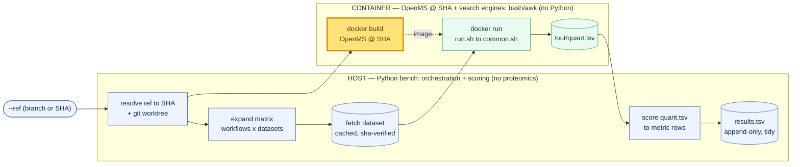
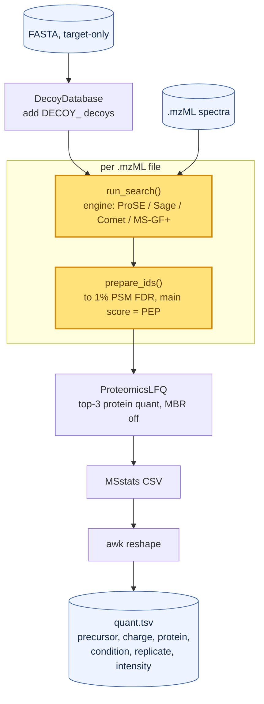

# Benchmarking your OpenMS tools

This repo is a **controlled benchmark** for OpenMS. It builds a given OpenMS git ref in
Docker, runs fixed proteomics workflows on pinned datasets, scores the output on the host,
and appends quality + performance metrics to a tidy TSV. **The OpenMS build is the only
thing that changes between runs** — datasets, search parameters, scoring, and thread count
are all pinned — so any metric delta is attributable to OpenMS itself.

> **Running example.** Throughout, we follow `lfq-prose × proteobench_module2`: the
> **ProSE** search engine (a *native OpenMS* tool) on **ProteoBench Module 2** (a 3-species
> mix with known abundance ratios). Because ProSE ships inside OpenMS, the highlighted build
> box below *is* the code under test.

## The pipeline at a glance



The yellow box is the **only independent variable** — everything around it is frozen. The
**host** (Python `bench`) does pure orchestration and scoring and holds no proteomics logic;
the **container** (built from the branch's *own* `dockerfiles/Dockerfile`, target
`tools-thirdparty`) has OpenMS TOPP tools + search engines and no Python. The matrix pairs
each workflow with every dataset whose `category` matches the workflow's `applies_to`; a
per-pair failure is logged as a `run_failed` row and the run continues to the next pair.

## The host ⇄ container contract

The two sides communicate **only** through three bind mounts and a handful of env vars, so a
workflow script never hardcodes a path and the split stays honest.

| Channel | Seen inside the container as | Carries |
| --- | --- | --- |
| mount `/work` *(ro)* | — | workflow scripts: `run.sh`, `common.sh`, `lib/` |
| mount `/data` *(ro)* | `INPUT_DIR=/data` | dataset spectra + FASTA (cached, sha-verified) |
| mount `/out` *(rw)* | `OUT_DIR=/out` | this run's `quant.tsv`, work dir, `design.tsv` |
| env `FASTA` | `/data/<fasta-filename>` | the manifest's target protein database |
| env `PREC_TOL_PPM` / `FRAG_TOL_DA` | tolerances | from the dataset's ground truth |
| env `THREADS` | fixed thread count | held constant for fair perf comparison |
| env `OPENMS_BIN` | `/opt/OpenMS/bin` | where the TOPP tools live |
| env `DESIGN_TSV` | `/out/design.tsv` | experimental design (run → condition/replicate) |

## Inside a workflow

Every workflow sources an engine search lib, then the shared `common.sh` chain. Only two
boxes are engine-specific — the rest is identical for every engine:



`run_search()` is engine-specific. `prepare_ids()` ends with the `Posterior Error
Probability` main score `ProteomicsLFQ` requires, and comes in three forms:

- **`idpep`** *(default)* — IDPosteriorErrorProbability → FalseDiscoveryRate → IDFilter @1% PSM → PEP as main score.
- **`percolator`** — PSMFeatureExtractor → PercolatorAdapter → IDFilter → PEP. Only `lfq-comet-perc` and `lfq-msgf-perc` use it, because `PSMFeatureExtractor` supports only Comet / X!Tandem / MS-GF+.
- **engine override** — our example, **ProSE**, replaces `prepare_ids()` entirely: `IDPosteriorErrorProbability` can't model ProSE scores, so it relabels ProSE's own q-value as PEP.

Cross-engine fairness comes from holding the search params identical across engines —
Trypsin, 2 missed cleavages, fixed Carbamidomethyl(C), variable Oxidation(M), 1% PSM FDR,
MBR off, top-3 protein quant — so only the per-dataset tolerances vary. The one
adapter-level exception is **MS-GF+**, which uses `Trypsin/P` and takes its fragment
tolerance from an `-instrument high_res` preset rather than the per-dataset `FRAG_TOL_DA`.

## What comes out

The scorer turns `quant.tsv` into metric rows. For an LFQ dataset it assigns each protein to
a species (drop `Cont_` contaminants **first**, then match the species suffix), drops
cross-species precursors, requires quant in **both** conditions, and reports per-species
**median log2(A/B)** and **mean-abs-error vs the expected ratio**, plus precursor/protein
counts and intra-condition CV.

> For `proteobench_module2` the expected log2(A/B) is **HUMAN 0**, **YEAST +1**,
> **ECOLI −2**. `mean_abs_error_*` against those three numbers is the headline quality
> signal — a worse OpenMS build drifts away from them.

Every run *also* gets harness-measured **`wall_clock_s`**, **`peak_container_mem_bytes`**
(read from the container's cgroup), and **`workflow_returncode`**, regardless of scorer.

Results land in `results/results.tsv`, **append-only and long/tidy** — 9 identity columns
plus `metric_name, metric_value, unit`, one row per measured value:

```
openms_sha  openms_tag  workflow   engine  dataset              instrument   threads  metric_name           metric_value  unit
a1b2c3...   my-branch   lfq-prose  prose   proteobench_module2  QExactiveHF  8        mean_abs_error_YEAST  0.12          log2
a1b2c3...   my-branch   lfq-prose  prose   proteobench_module2  QExactiveHF  8        wall_clock_s          842.5         s
```

Adding a metric, workflow, or dataset never changes the schema. **Performance metrics are
never comparable across datasets or hosts** — which is exactly why `dataset`, `instrument`,
`host_cpu`, and `threads` are always identity columns. View it as a wide table with
`uv run python pivot.py results/results.tsv`.

## Benchmark your own tool

Point the harness at any ref; it builds, runs the whole matrix, scores, and appends:

```bash
uv run python -m bench --ref my-feature-branch
# ...or narrow the matrix:
uv run python -m bench --ref <sha> --workflow lfq-prose --dataset proteobench_module2
```

**To add a workflow for your engine**, drop in two files — no Python, no harness changes:

1. `workflows/lib/search-<engine>.sh`, defining `run_search()`:
   ```bash
   run_search() {
     local mzml="$1" db="$2" out_id="$3"
     YourEngineAdapter -in "$mzml" -database "$db" -out "$out_id" \
       -enzyme Trypsin -allowed_missed_cleavages 2 \
       -fixed_modifications "Carbamidomethyl (C)" \
       -variable_modifications "Oxidation (M)" \
       -precursor_tol "$PREC_TOL_PPM" -fragment_tol "$FRAG_TOL_DA" \
       -threads "$THREADS"
   }
   ```
2. `workflows/lfq-<engine>/` with a `meta.yaml` (`type: lfq-quant`, `applies_to: lfq`) and a
   tiny `run.sh`:
   ```bash
   #!/usr/bin/env bash
   set -euo pipefail
   source "$(dirname "$0")/../lib/search-<engine>.sh"   # defines run_search()
   source "$(dirname "$0")/../common.sh"                # the shared DDA-LFQ chain
   ```

The harness auto-discovers the workflow and pairs it with every dataset whose `category`
matches `applies_to`.

> *Need custom ID handling?* Override `prepare_ids()` **before** sourcing `common.sh` —
> exactly what `lfq-prose` does to fit ProSE's scoring into the chain.
