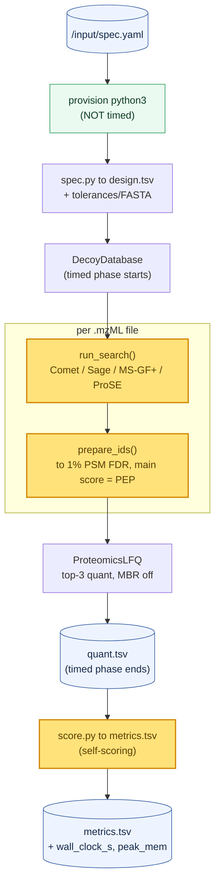

# Benchmarking OpenMS against other tools

This repo is a **controlled benchmark** that compares OpenMS against other proteomics
tools (e.g. FragPipe, not yet wired up) on a shared task. Each tool runs in **its own container**; a
**mounted script runs the tool and scores its own output**, emitting one `metrics.tsv`. The
host is a thin orchestrator: it materializes images, runs each benchmark, and harvests the
results. The OpenMS image is *built from a git ref* (the high-level version knob), so you can
also compare OpenMS-vs-OpenMS by bumping that ref.

> **Running example.** `comet × proteobench_module2`: the OpenMS **Comet** workflow on
> **ProteoBench Module 2** (a 3-species mix with known abundance ratios).

## The pipeline at a glance


The **host** holds no proteomics or scoring logic. The **container** is the tool's own
image: the OpenMS image is the branch's `tools-thirdparty` build (untouched); external tools
are pulled by pinned tag. Whatever a script needs that the image lacks (e.g. Python for the
OpenMS scorer) it installs on demand at run time.

## The host ⇄ container contract

Three bind mounts and a minimal env set — nothing dataset-specific is passed as an env var;
that all lives in the input bundle's `spec.yaml`.

| Channel | Inside the container | Carries |
| --- | --- | --- |
| mount `/work` *(ro)* | `WORK=/work` | mounted scripts: `openms/<tool>.sh`, `lib/` (`common.sh`, `search-*.sh`, `spec.py`, `score.py`, `emit.sh`) |
| mount `/input` *(ro)* | `INPUT_DIR=/input` | the bring-your-own bundle: `spec.yaml` + `.mzML` + FASTA |
| mount `/out` *(rw)* | `OUT_DIR=/out` | the run's `metrics.tsv`, `quant.tsv`, work dir |
| env `THREADS` | fixed thread count | held constant for fair perf comparison |
| env `OPENMS_BIN` | `/opt/OpenMS/bin` | where the TOPP tools live |

The container's only required output is **`/out/metrics.tsv`** (`metric  value  unit`); its
stdout+stderr are captured by the host into `/out/error.log`.

## Inside an OpenMS workflow

Each OpenMS run script sources an engine search lib, then the shared `common.sh` chain.
`common.sh` provisions Python, builds `design.tsv` + tolerances from `spec.yaml`, runs the
search → quant chain (timed), then self-scores into `metrics.tsv`.



`run_search()` is engine-specific. `prepare_ids()` ends with the `Posterior Error
Probability` main score `ProteomicsLFQ` requires, in three forms:

- **`idpep`** *(default)* — IDPosteriorErrorProbability → FalseDiscoveryRate → IDFilter @1% PSM → PEP.
- **`percolator`** — PSMFeatureExtractor → PercolatorAdapter → IDFilter → PEP. Only `comet-perc` and `msgf-perc` use it (`PSMFeatureExtractor` supports only Comet / X!Tandem / MS-GF+).
- **engine override** — `prose.sh` replaces `prepare_ids()` entirely (IDPosteriorErrorProbability can't model ProSE scores, so it relabels ProSE's own q-value as PEP).

Cross-engine fairness for the OpenMS family is structural — every engine funnels through the
one `common.sh` with identical params (Trypsin, 2 missed cleavages, fixed Carbamidomethyl(C),
variable Oxidation(M), 1% PSM FDR, MBR off, top-3 quant); only per-dataset tolerances vary.
(MS-GF+ uses `Trypsin/P` + an `-instrument high_res` fragment preset — a known gap.)

> **Cross-*tool* fairness** is the metric contract, not shared code: every benchmark of a
> type emits the same metric columns, computed by whatever scorer its script ships. Drift
> between two tools' scorers is a risk the contract makes visible but does not prevent.

## What comes out

`score.py` turns `quant.tsv` into metric rows: assign each protein to a species (drop `Cont_`
contaminants **first**, then match the species suffix), drop cross-species precursors, require
quant in **both** conditions, and report per-species **median log2(A/B)** and **mean-abs-error
vs the expected ratio**, plus precursor/protein counts and intra-condition CV. The script also
emits **`wall_clock_s`** and **`peak_mem_bytes`** scoped to the *timed* phase (it resets the
cgroup peak counter after provisioning).

> For `proteobench_module2` the expected log2(A/B) is **HUMAN 0**, **YEAST +1**, **ECOLI −2**.

There is **no central ledger.** Each run writes three files under
`results/runs/<openms-ref>/<tool>/<dataset>/`:

| file | written by | holds |
| --- | --- | --- |
| `metrics.tsv` | container | `metric  value  unit` rows (the comparable result) |
| `error.log` | host (redirect) | the container's stdout+stderr |
| `run.json` | host | provenance: image tag, ref, threads, host_cpu, timestamp, returncode, outer wall, `metrics_valid` |

The host validates each `metrics.tsv` against the benchmark-type's declared metric schema
(in `benchmarks.yaml`) — missing required metrics → `metrics_valid: false`. Build a wide
comparison across the whole tree on demand:

```bash
uv run python -m bench aggregate            # -> wide TSV on stdout
```

## Run it / add a tool

```bash
cp config.example.toml config.toml
uv run python -m bench run                                  # whole matrix
uv run python -m bench run --benchmark comet                # one benchmark
uv run python -m bench run --openms-ref <sha>               # sweep OpenMS version
```

**Add an OpenMS engine:** drop `scripts/lib/search-<engine>.sh` (defines `run_search()`) +
`scripts/openms/<engine>.sh` (sources it then `common.sh`), and add a `benchmarks.yaml`
entry. **Add an external tool:** add an `images.yaml` entry (`pull: tool:tag`), a
`scripts/<tool>/<tool>.sh` that runs the tool and writes `/out/metrics.tsv` with the
benchmark-type's metric columns, and a `benchmarks.yaml` entry pointing at it.

**Prepare an input bundle:** a folder with `spec.yaml` (design, tolerances, species rules,
expected ratios) + the `.mzML` + FASTA. Populate it however you like; `tools/fetch.py` is an
optional out-of-band helper that fetches + sha-verifies + gunzips into the folder.
